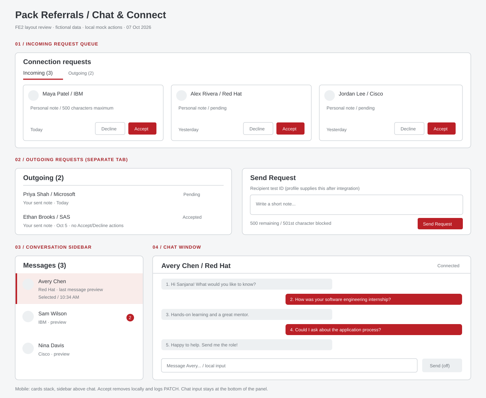

# Chat / Connect wireframes

Prepared 2026-10-07 for the FE2 weeks 2–5 deliverables. All people/requests shown are fictional. **Team-channel sharing and PM review are pending.**

The [PNG export](wireframes/chat-connect.png) is ready to upload in the team channel.

| Area | Layout and interactions | Component |
| --- | --- | --- |
| Incoming queue | Three cards across on desktop; stacked on narrow screens. Sender, company, short note, pending status, Accept/Decline. Action removes local card; count updates. | `RequestQueue` → `ConnectionRequestCard` |
| Outgoing list | Same card family; recipient, note and status. No incoming action buttons. A separate tab keeps directions clear. | `RequestQueue` → `ConnectionRequestCard` |
| Conversation sidebar | Name/company, last-message preview, time and unread badge. Selected row has a red border and tint. | `ConversationListItem` |
| Chat window | Person header, scrolling thread, incoming left / own right, times, composer pinned to the panel bottom. Initial thread has five messages. | `ChatWindow` → `MessageBubble` |
| Request form | Recipient ID for test setup, note, live `500 remaining` counter, Send Request, inline HTTP feedback. Shared profile integration can supply recipient prop later. | `SendRequestForm` |

Mobile: request cards stack; sidebar appears above the thread; bubble widths stay within the viewport; the composer remains at the bottom of its chat panel. This is a static demo, not the later fully responsive production chat integration.

The SVG is the low-fidelity layout review. `/chat-mock` is the working component preview. Do not mark wireframes approved until PM/team feedback is recorded.
