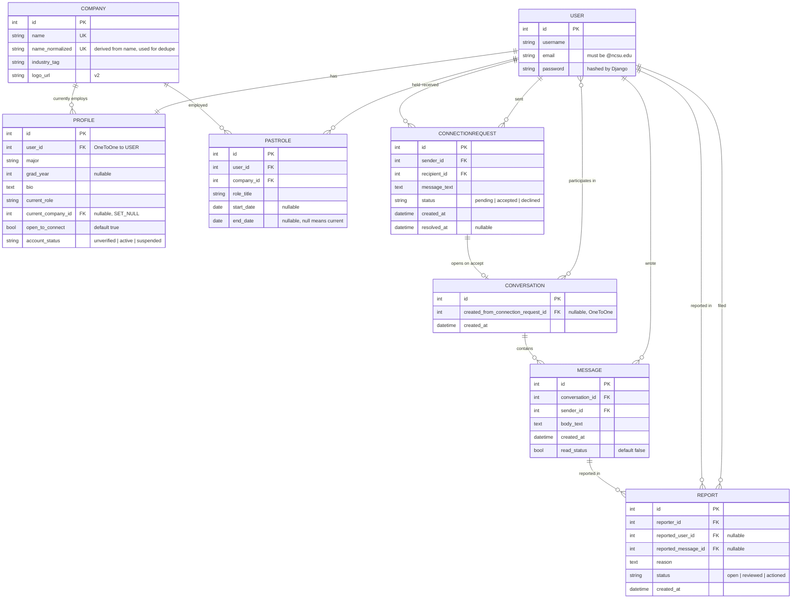

# Pack Referrals — Entity Relationship Diagram

Current state of the data model as defined in [`api/models.py`](../api/models.py).
GitHub renders the Mermaid diagram below automatically.

This is kept in version control rather than as an exported image so that schema
changes show up in pull request diffs.

## Notes on the model

**`USER` is Django's built-in model**, not one we define. It supplies
authentication, password hashing and the admin integration. `PROFILE` extends it
one-to-one with our domain fields rather than replacing it.

**`PROFILE.account_status` gates everything.** A new account starts
`unverified` and cannot be treated as a real member until the `@ncsu.edu`
verification code is confirmed, which moves it to `active`. `suspended` is set
by a moderator acting on a report.

**`COMPANY.name_normalized` exists for deduplication.** It is derived
automatically from `name` on save — lowercased, whitespace collapsed, trailing
`inc`/`llc`/`ltd`/`corp` removed. This is what "who works at Google" matches on,
so that `Google`, `google ` and `Google Inc.` resolve to one company rather than
three.

**Company affiliation is derived, not stored.** There is no explicit
`CompanyAffiliation` table — "who from NC State works here" is a query across
`PASTROLE` plus `PROFILE.current_company`.

**`CONNECTIONREQUEST` is the access-control gate for messaging.** A
`CONVERSATION` is only created when a request is accepted, which is what
prevents unsolicited messages.

## Open questions

These affect the schema and are not settled yet:

- **No `Block` model exists**, though spec section 4.6 requires blocking a user.
  It needs somewhere to live — probably its own table with blocker/blocked
  foreign keys.
- **Nothing prevents duplicate pending `CONNECTIONREQUEST` rows** between the
  same two users. The spec lists this as an edge case to handle; a database-level
  unique constraint on (sender, recipient) filtered to `status='pending'` would
  enforce it rather than relying on view logic.
- **`CONVERSATION` uses a plain many-to-many** to users. The Sprint 1 plan
  describes a `ConversationParticipant` through-model, which would be needed to
  store per-participant state such as "hidden after block" or last-read position.
- **`account_status` naming.** The spec describes the lifecycle as
  `unverified → verified → (active/suspended)`, while the sprint tracker says
  verification sets the status to `active`. This implementation treats `active`
  as meaning verified. Worth confirming.
