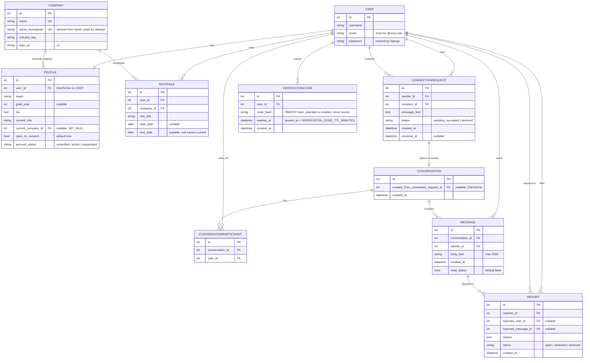

# Pack Referrals — Entity Relationship Diagram

Current state of the data model as defined in domain apps:
[`accounts/models.py`](../accounts/models.py),
[`companies/models.py`](../companies/models.py),
[`connections/models.py`](../connections/models.py),
[`chat/models.py`](../chat/models.py).
GitHub renders the Mermaid diagram below automatically.

This is kept in version control rather than as an exported image so that schema
changes show up in pull request diffs.

```mermaid
erDiagram
    USER ||--|| PROFILE : "has"
    USER ||--o{ PASTROLE : "held"
    USER ||--o{ CONNECTIONREQUEST : "sent"
    USER ||--o{ CONNECTIONREQUEST : "received"
    USER ||--o{ CONVERSATIONPARTICIPANT : "joins via"
    CONVERSATION ||--o{ CONVERSATIONPARTICIPANT : "has"
    USER ||--o{ MESSAGE : "wrote"
    USER ||--o{ REPORT : "filed"
    USER ||--o{ REPORT : "reported in"
    USER ||--o{ VERIFICATIONCODE : "issued"

    COMPANY ||--o{ PASTROLE : "employed"
    COMPANY ||--o{ PROFILE : "currently employs"

    CONNECTIONREQUEST ||--o| CONVERSATION : "opens on accept"
    CONVERSATION ||--o{ MESSAGE : "contains"
    MESSAGE ||--o{ REPORT : "reported in"

    USER {
        int id PK
        string username
        string email "must be @ncsu.edu"
        string password "hashed by Django"
    }

    VERIFICATIONCODE {
        int id PK
        int user_id FK
        string code_hash "PBKDF2 hash; plaintext is emailed, never stored"
        datetime expires_at "issued_at + VERIFICATION_CODE_TTL_MINUTES"
        datetime created_at
    }

    PROFILE {
        int id PK
        int user_id FK "OneToOne to USER"
        string major
        int grad_year "nullable"
        text bio
        string current_role
        int current_company_id FK "nullable, SET_NULL"
        bool open_to_connect "default true"
        string account_status "unverified | active | suspended"
    }

    COMPANY {
        int id PK
        string name UK
        string name_normalized UK "derived from name, used for dedupe"
        string industry_tag
        string logo_url "v2"
    }

    PASTROLE {
        int id PK
        int user_id FK
        int company_id FK
        string role_title
        date start_date "nullable"
        date end_date "nullable, null means current"
    }

    CONNECTIONREQUEST {
        int id PK
        int sender_id FK
        int recipient_id FK
        text message_text
        string status "pending | accepted | declined"
        datetime created_at
        datetime resolved_at "nullable"
    }

    CONVERSATION {
        int id PK
        int created_from_connection_request_id FK "nullable, OneToOne"
        datetime created_at
    }

    CONVERSATIONPARTICIPANT {
        int id PK
        int conversation_id FK
        int user_id FK
    }

    MESSAGE {
        int id PK
        int conversation_id FK
        int sender_id FK
        string body_text "max 2000"
        datetime created_at
        bool read_status "default false"
    }

    REPORT {
        int id PK
        int reporter_id FK
        int reported_user_id FK "nullable"
        int reported_message_id FK "nullable"
        text reason
        string status "open | reviewed | actioned"
        datetime created_at
    }
```

## Notes on the model

**`USER` is Django's built-in model**, not one we define. It supplies
authentication, password hashing and the admin integration. `PROFILE` extends it
one-to-one with our domain fields rather than replacing it.

**`VERIFICATIONCODE` holds only a hash.** The six-digit code is generated with
`secrets`, emailed in plaintext, and stored as a PBKDF2 hash using the same
hasher as passwords. Issuing a new code deletes any outstanding one, and a
successful verification deletes it, so a code is strictly single-use.

**`PROFILE.account_status` gates everything.** A new account starts
`unverified` and cannot be treated as a real member until the `@ncsu.edu`
verification code is confirmed, which moves it to `active`. `suspended` is set
by a moderator acting on a report.

**`COMPANY.name_normalized` exists for deduplication.** It is derived
automatically from `name` on save — lowercased, whitespace collapsed, trailing
`inc`/`llc`/`ltd`/`corp` removed. This is what "who works at Google" matches on,
so that `Google`, `google ` and `Google Inc.` resolve to one company rather than
three.

**Company affiliation is derived, not stored.** There is no explicit
`CompanyAffiliation` table — "who from NC State works here" is a query across
`PASTROLE` plus `PROFILE.current_company`.

**`CONNECTIONREQUEST` is the access-control gate for messaging.** A
`CONVERSATION` is only created when a request is accepted, which is what
prevents unsolicited messages.

## Open questions

These affect the schema and are not settled yet:

- **No `Block` model exists**, though spec section 4.6 requires blocking a user.
  It needs somewhere to live — probably its own table with blocker/blocked
  foreign keys.
- **Nothing prevents duplicate pending `CONNECTIONREQUEST` rows** between the
  same two users. The spec lists this as an edge case to handle; a database-level
  unique constraint on (sender, recipient) filtered to `status='pending'` would
  enforce it rather than relying on view logic.
- **`ConversationParticipant`** is the M2M through-table for conversations.
  Per-participant state (e.g. hidden after block, last-read) can be added there later.
- **`account_status` naming.** The spec describes the lifecycle as
  `unverified → verified → (active/suspended)`, while the sprint tracker says
  verification sets the status to `active`. This implementation treats `active`
  as meaning verified. Worth confirming.
